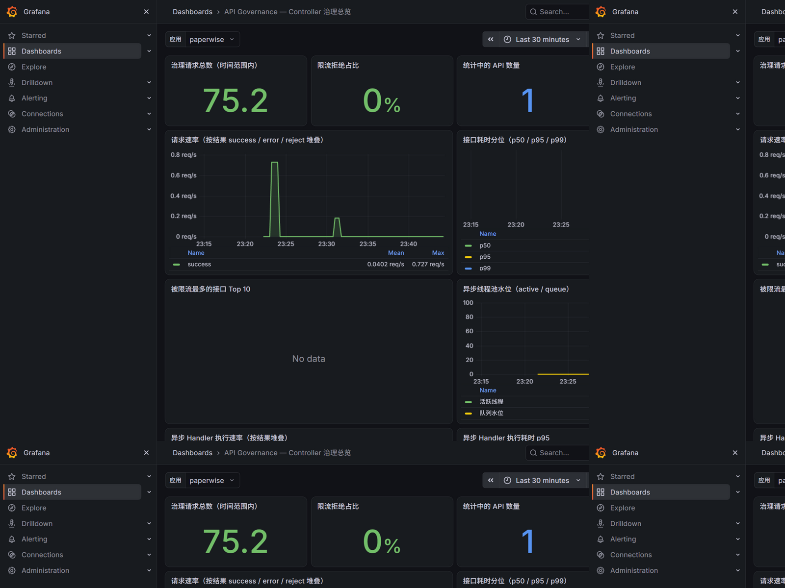

# 可观测性（内存指标 / Micrometer / Grafana / 告警）

> 本文档为[项目主页](../README.md)的拆分章节；索引与快速开始见主页。

## 内存指标统计

指标保存在内存中（随进程启动而创建、随进程关闭而销毁，不持久化）。为防止内存膨胀：

- 每个 API 的「最近请求记录」使用**有界滑动窗口**（`window-size` 条数上限 + `window-seconds` 时间上限）；
- 全局 API 数量上限 `max-apis`，超限按 LRU 淘汰。

记录内容：总请求数、成功/失败/拒绝数、慢方法数、最小/最大/平均耗时，以及最近请求明细。

---

---

## Micrometer 指标桥接（0.2.0 新增）

治理事件会自动同步为标准 Micrometer 指标（容器存在 `MeterRegistry` Bean 即生效，
`api.governance.metrics.micrometer-enabled` 可关闭），直接对接 Prometheus / Grafana 等生态：

| 指标 | 类型 | 标签 | 说明 |
|------|------|------|------|
| `api.governance.requests` | Counter | api, method, outcome | 请求总数；outcome ∈ success/error/reject |
| `api.governance.request.duration` | Timer | api, method | 请求耗时分布（不含被拒绝请求） |
| `api.governance.apis.tracked` | Gauge | 无 | 当前统计的 API 数量 |

```yaml
management:
  endpoints:
    web:
      exposure:
        include: prometheus   # 暴露 /actuator/prometheus
```

> `api` 标签 = `全限定类名#方法名`，基数上限为 Controller 方法数，无标签膨胀风险。
> Meter 一旦创建即常驻 Micrometer 注册表，清理需走 Micrometer 自身机制（内存注册表的 LRU
> 淘汰与 DELETE 指标清空不会同步删除 Meter）。

### Grafana 面板（0.6.0 新增）

仓库内置现成面板 [`grafana/api-governance-dashboard.json`](../grafana/api-governance-dashboard.json)
（10 个面板：治理请求总量 / 拒绝占比 / 异常占比 / API 数量、请求速率按 outcome 堆叠、
耗时 p50/p95/p99、被限流接口 Top 10、异步执行速率与线程池水位），已在真实
PaperWise 应用 + Prometheus + Grafana 链路上验证：



**导入方式**：Grafana → Dashboards → Import → 上传 JSON，导入时选择你的 Prometheus
数据源（JSON 中数据源 uid 为 `prometheus-gov`，导入向导会提示替换）；顶部「应用」变量
按 `application` 标签过滤，多应用共用一个 Prometheus 时可直接切换。

**前置条件**：

```xml
<!-- 1. 引入 Prometheus 注册表（actuator 为 api-governance 的可选依赖，需显式声明） -->
<dependency>
    <groupId>io.micrometer</groupId>
    <artifactId>micrometer-registry-prometheus</artifactId>
</dependency>
```

```yaml
# 2. 暴露抓取端点
management:
  endpoints:
    web:
      exposure:
        include: health,prometheus
  metrics:
    distribution:
      # 3. 分位面板（p50/p95/p99）需要 histogram 桶；不开启时该面板无数据，其余面板不受影响
      percentiles-histogram:
        api.governance.request.duration: true
```

---

---

## 告警插件（0.2.0 新增）

慢方法、限流拒绝、限流器故障三类事件可回调自定义通知器：

```java
@Component
public class MyAlertNotifier implements GovernanceAlertNotifier {

    @Override
    public void notify(GovernanceAlertEvent event) {
        // 事件只携带元数据：type / apiKey / path / elapsedMs / message / timestamp
        // 通知器在请求线程被同步调用，慢 IO 请自行异步化
    }
}
```

内置 `WebhookAlertNotifier`（零额外依赖，基于 JDK HttpClient 异步发送）可对接钉钉/企微/飞书机器人（0.3.0 起为原生消息格式，钉钉支持加签）：

```yaml
api:
  governance:
    alert:
      enabled: true
      suppress-interval-ms: 10000   # 同 (类型, apiKey) 10 秒内只发一次，防告警风暴
      webhook:
        enabled: true
        platform: dingtalk            # generic / dingtalk / wecom / feishu
        url: "https://oapi.dingtalk.com/robot/send?access_token=xxx"
        sign-secret: ${DINGTALK_SECRET}   # 钉钉机器人开启「加签」安全设置时必填
```

- `dingtalk`/`wecom`：发送 `{"msgtype":"text","text":{"content":...}}` 原生格式；
- `feishu`：发送 `{"msg_type":"text","content":{"text":...}}` 原生格式；
- `dingtalk` 且配置 `sign-secret` 时，自动按钉钉规范在 URL 追加 `timestamp` 与 `sign`（HMAC-SHA256 + Base64）；
- `generic`（默认）：框架自有 JSON 格式（0.2.0 行为），字段为完整事件元数据。

统一分发器（`AlertDispatcher`）负责告警风暴抑制与异常隔离：任一通知器抛出异常只记 warn 日志，
绝不影响业务请求。事件不含方法入参、返回值与异常堆栈，无敏感信息外泄风险。

**告警恢复通知（0.6.0 新增，`api.governance.alert.recovery-enabled` 默认开）**：
异常状况解除后自动补发恢复事件（`recovered=true`，携带抑制期内被静默丢弃的条数）：

- **限流器故障**：故障后首次成功获取配额即上报恢复（精确信号，如 Redis 恢复后第一个请求）；
- **慢方法 / 限流拒绝**：对应 (类型, apiKey) 安静超过一个抑制窗口后，由下一次告警分发
  惰性扫描补发恢复（系统完全安静时恢复通知会延迟到下一个事件到达）；
- 恢复事件本身不受抑制窗口约束；钉钉/企微/飞书文案以「【API治理恢复】」前缀区分。

---
